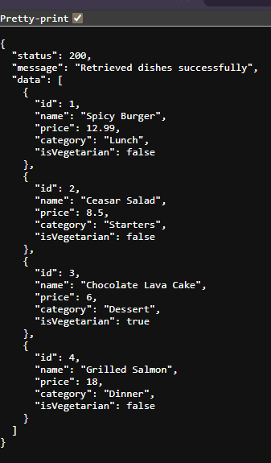

1. Markdown
2. # RESTful API Activity - [Your Name]
3. ## Best Practices Implementation
4. **1. Environment Variables:**
5. - Why did we put `BASE_URI` in `.env` instead of hardcoding it?
6. - Answer: We put BASE_URI in the .env file instead of hardcoding it so we can change the API’s base path without editing the source code and this makes the application easier to manage and reduces the chance of errors.
7. **2. Resource Modeling:**
8. - Why did we use plural nouns (e.g., `/dishes`) for our routes?
9. - Answer: We used plural nouns because they represent a collection of resources and follow standard REST API conventions, making the routes clear and consistent.
10. **3. Status Codes:**
11. - When do we use `201 Created` vs `200 OK`?
Answer: We use 201 Created when a new resource is successfully created, such as after a POST request, and 200 OK when a request is successful but does not create a new resource.
12. - Why is it important to return `404` instead of just an empty array or a generic error?
13. - Answer: It is important to return 404 because it clearly tells the client that the requested resource was not found. This makes the API easier to understand, and lets the client handle the error properly.
14.
15. **4. Testing:**
16. - (Paste a screenshot of a successful GET request here)

